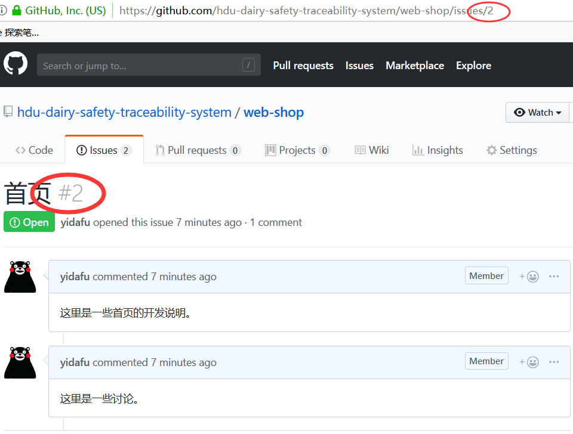

# 项目主文档目录

## 技术栈

### 前端

+ [react](https://react.docschina.org/) (全家桶: [router](https://reacttraining.com/react-router/) [redux](https://redux.js.org/))
+ [antd](https://ant.design/docs/react/introduce-cn)
+ [bootstrap-react](https://react-bootstrap.github.io/)
### 后端

+ [Django](https://www.djangoproject.com/)

## 工作流

+ git commit 规范：[阮一峰-Commit message 和 Change log 编写指南](http://www.ruanyifeng.com/blog/2016/01/commit_message_change_log.html)
     **建议遵循**
+ git flow 参考：[深入理解学习Git工作流](https://segmentfault.com/a/1190000002918123)，[Git Flow简介](https://segmentfault.com/a/1190000006194051)
     上面的作为指南，我们开发时不全部照着来。我们使用的的[简化版工作流](#team-git-flow)

### <a href="#team-git-flow">简化版工作流</a>

首先新建一个 Issues，列出待开发的 feature。

再开一个 Issues 作为 feature 的开发详情页。

建立相应的分支。**一般讲分支名定义为`issuesId-featureName`**。`issuesId`一般是一个自增的`int`。见下图：

比如这里的首页就可以定义为：`2-index`。

当 featrue 开发完成以后，通过 PullRequest 合并到 dev 分支即可。